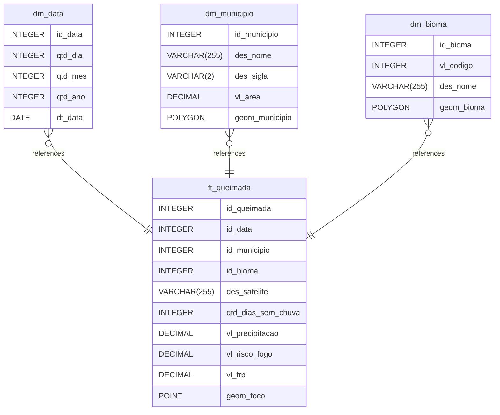

# Painel Curupira

Esse painel tem o objetivo de apresentar os focos de queimadas no Brasil utilizando os dados do [Programa de Queimadas do INPE (Instituto Nacional de Pesquisas Espaciais)](https://terrabrasilis.dpi.inpe.br/queimadas/portal/dados-abertos/).

## Arquitetura

Foi desenvolvido um pipeline de Ingestão, Processamento e Carregamento dos dados. Para isso, foram utilizados containers Docker de Airflow, MinIO, Spark, PostGIS e Streamlit.


## Modelagem

Os dados foram modelados em esquema estrela para facilitar o consumo da aplicação.



## Como utilizar o projeto

### 1) Criar a rede utilizada nos containers dockers

```
bash create-network.sh
```

### 2) Subir os containers

```
docker-compose -f docker-airflow/docker-compose.yml -f docker-minio/docker-compose.yml -f docker-postgis/docker-compose.yml -f docker-spark/docker-compose.yml -f docker-streamlit/docker-compose.yml up --build
```

### 4) Executar os pipelines dos dados no airflow


### 5) Acessar [localhost:8501](http://localhost:8501/)

#### Aba de Boas Vindas


#### Aba de Visão Geral


#### Aba de Gráficos


